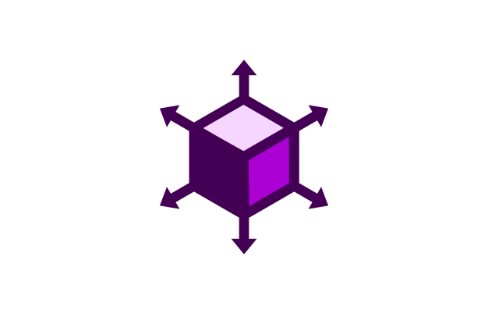

<p align="center">
  <a href="https://github.com/LovePelmeni/Infrastructure.git"></a>
</p>

<p align="center">
    <em>Web Cloud Infrastructure, Deploy Your Applications easily, taking less effort</em>
</p>


---

**Documentation**: [https://github.com/LovePelmeni/Web-CloudInfrastructure/README.md]("https://github.com/LovePelmeni/Web-Cloud-Infrastructure/README.md")

**Source Code**: ["https://github.com/LovePelmeni/Web-Cloud-Infrastructure.git]("http://github.com/LovePelmeni/Web-Cloud-Infrastructure.git")


--- 

 **KubeLagoon** - Prototype of the Cloud Infrastructure, that provides ability to setup Virtual Servers with Custom Configuration and OS, Private and Public Networks.
The Service is being developed since 17 August of 2022, and is focused on Design Improvement and Quick Interaction to make User Experience much better

--- 

# Requirements  

*To Deploy this Application onto Your Machine requires Following setup*


## *Initial Tools* 

NOTE: In order to make the Cloud Functionality to work you need to setup 
Host Machine, which going to be immitating Datacenter with the `VMWare ESXI Hypervisor` of any version on top of it

**Source for the licenses and installation files** : http://cios.dhitechnical.com/VMware/


**Guide how to set it up on the Host Machine**: https://www.youtube.com/watch?v=Fk1exbFnVfM&t=148s


### *Using Kubernetes*

1. Kubectl ~ `1.16.0 or higher`
2. Docker ~ `4.1 or higher`


### *Using Docker* 

1. Docker-Compose ~ `29.0.1 or higher`
2. Docker ~ ``

## *Extra Requirements* 

1. You need to have port `8000` to be opened 
2. You also need to have port `3000` to be opened

--- 

# Usage 

If you want to run it on your own, `Application` + Cloud Compute Server 
You need to setup HostMachine, so it can communicate with the API. 
Folow this Guide to setup `Host Machine`, which going to store the VM's, Networks etc... 
Requirements ~ Hardware (Memory at least 5Gi) (CPU at least 1.5Ghz), so in order to comfortably run VM servers

Once you've setup Host Machine, you need to follow this steps 

*If you want to run Application on your Local Machine* 


---

### Backend Build Steps 

1. Edit Project Environment Variable File located at Root Directory at Path Called `env`

2. Once you've done that, You can run docker-compose File and it will Run the App locally

```console

$ git clone https://github.com/LovePelmeni/Cloud-Infrastructure.git 

$ cd ./docker-compose 

$ docker-compose up -d

```

Great! Now You Successfully Run Backend Application, in order to Check if it's Up and Running, you can Execute: 

```commandline
$ curl -X GET -f http://localhost:8000/ping/
```


### Frontend Build Steps 

1. Edit Project Environment Variable File located at Root Directory at Path Called `env`

2. Once you've done that, You can run docker-compose File and it will Run the Frontend App locally 
```console

$ git clone https://github.com/LovePelmeni/Cloud-Infrastructure-Front-App.git 

$ cd ./docker-compose 

$ docker-compose up -d

```

Great! Now You Successfully Run Backend Application, in order to Check if it's Up and Running, you can Execute: 

```commandline
curl -X GET -f http://localhost:3000/ping/
```

--- 

Great! Now you setup the Frontend Application for the Project and The Whole App is Fully Configured 

You can go to your Browser at "http://localhost:3000/" and it will redirect you to the Cloud Infrastructure App 


